Excalidraw scenes / libraries illustrating Physics lectures

## Schematics

- [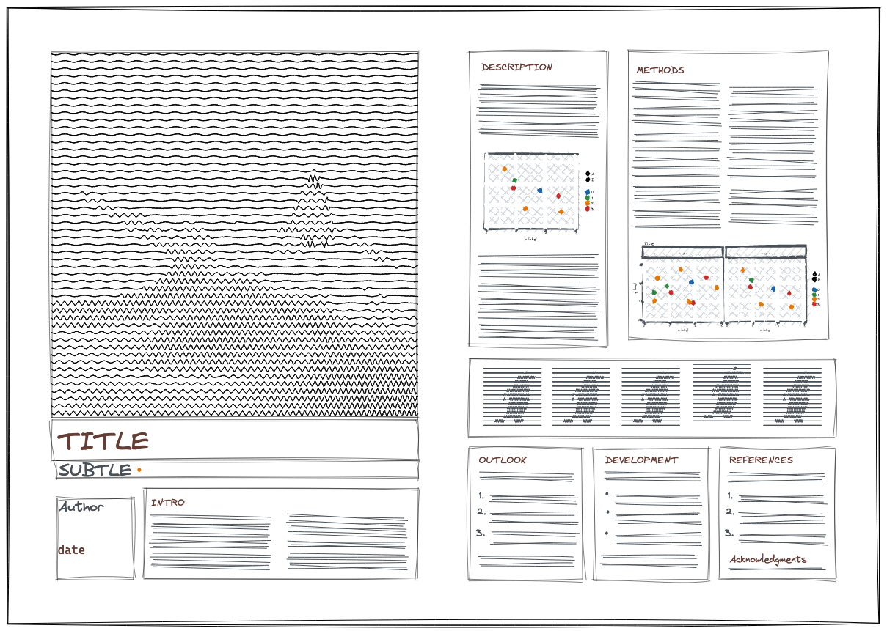](https://excalidraw.com/#json=R8bTTiauMvG9XK4msQhjV,dd5p40kSXeknsgGUoE4OwA)

- [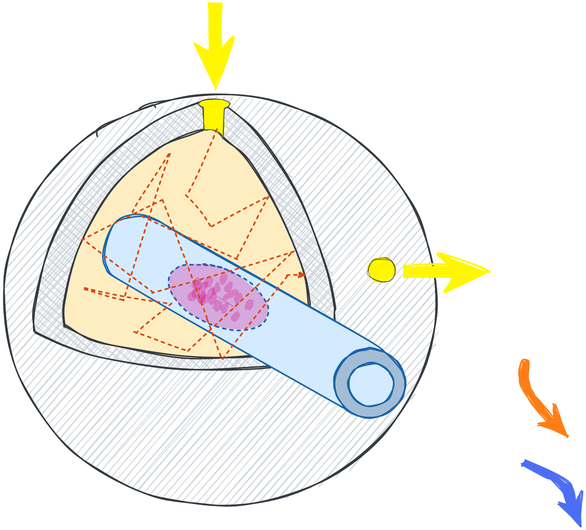](https://excalidraw.com/#json=vqi6wxPs6jaMH4tfnmMxu,BZscg2JQ2ehqxmzqpztjiw)

- [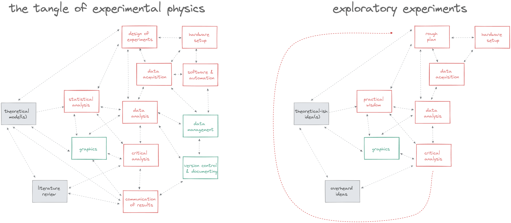](https://excalidraw.com/#json=G_bDYWV7YLkG8LTzVOF-4,ror1t7R5OTFJEYGSzMUMbg)

- [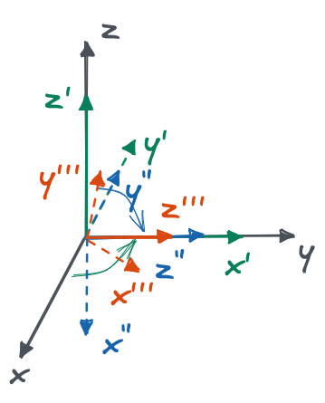](https://excalidraw.com/#json=7OvBTjkvY_FgOHzyqS1jh,grP0fWBAF3BeB5ZOVHz2bw)

- [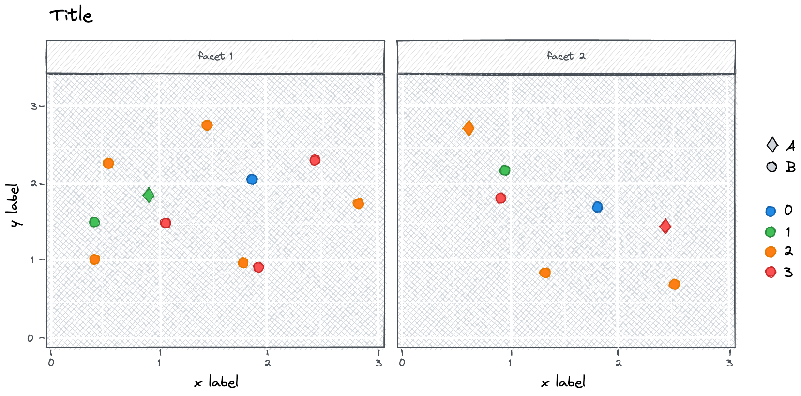](https://excalidraw.com/#json=HYOfll8cOju9lIcfNz6nj,prY4e229ghNDNFhlNKV-dw)

- [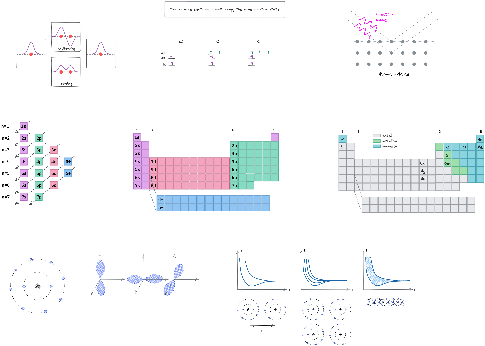](https://excalidraw.com/#json=-P9baqFi7eVGr5v9BnbeE,AAx1T8MXRYMgVJhpUuYrng)

- [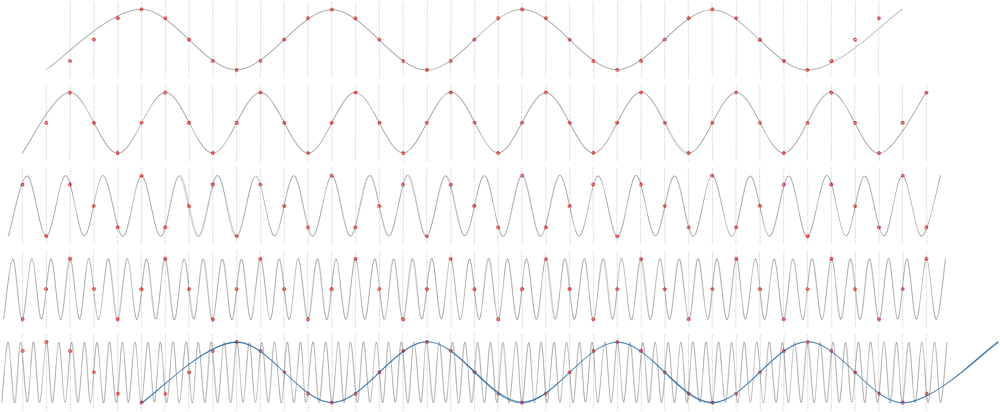](https://excalidraw.com/#json=xBXZZaUh-kKQKbniCBGJO,Tmxr-DIET6F8EXFdoZvo4g)

- [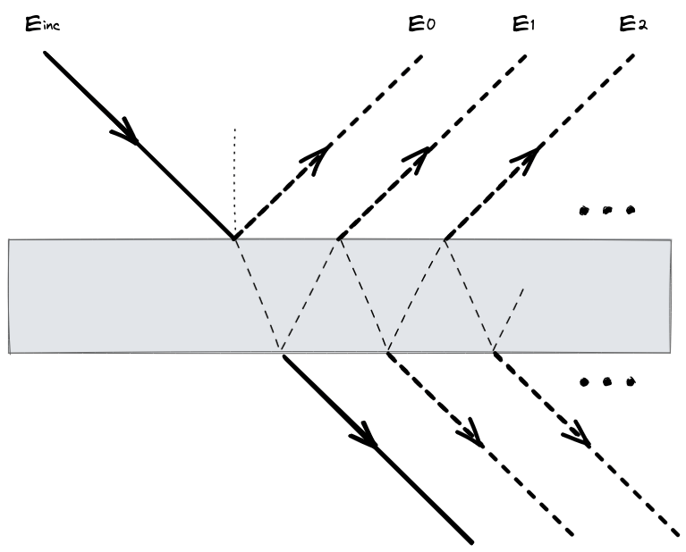](https://excalidraw.com/#json=ToOe6G0-PnbsVel_NSRk2,KSyLA6sir9OAcYeIZGPJSg)

## Maths

- [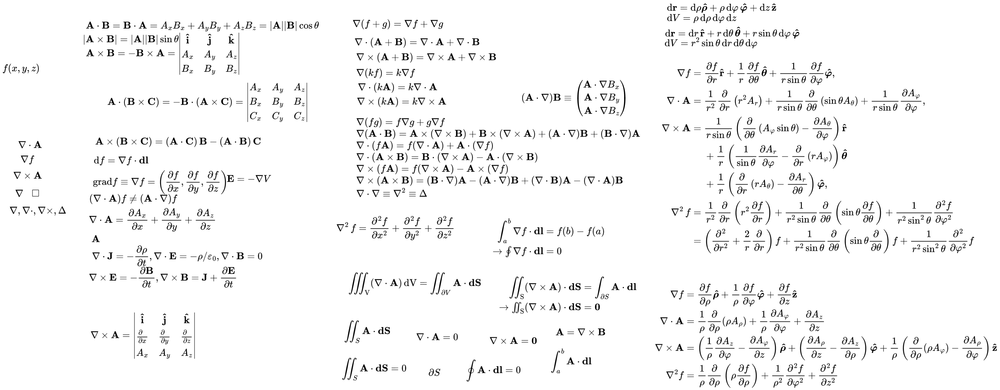](https://math.preview.excalidraw.com/#json=m5MJAxbU0BbBQ7C-OLoys,5Pg6gvRg0PVMUpU9J9ITCg)

- [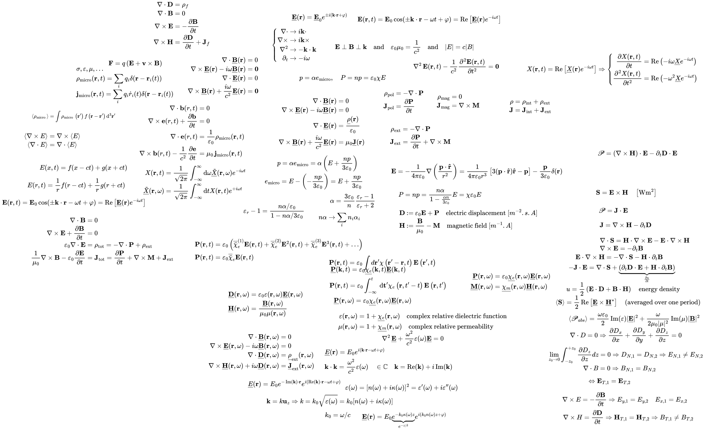](https://math.preview.excalidraw.com/#json=cT_h2NOTeNLXuO8e12naO,aiYw7bGAVl3iwj4S31C4Ag)

- [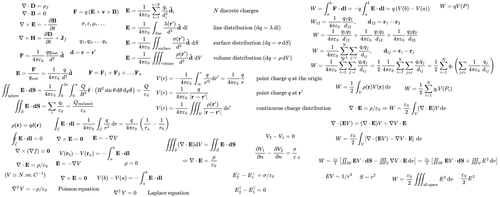](https://math.preview.excalidraw.com/#json=4UNJSZcM2Qd3UbIylmp69,SpDAYctIZBlCOcfoIzEFrA)

- [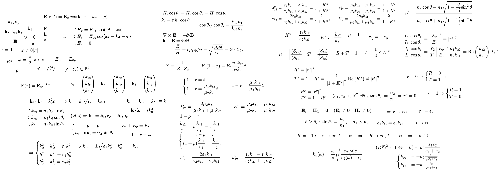](https://math.preview.excalidraw.com/#json=I0cMPH4NUw_v8gJPxLuOf,X6-2rV7wx1jeLQjHfznSaw)

- [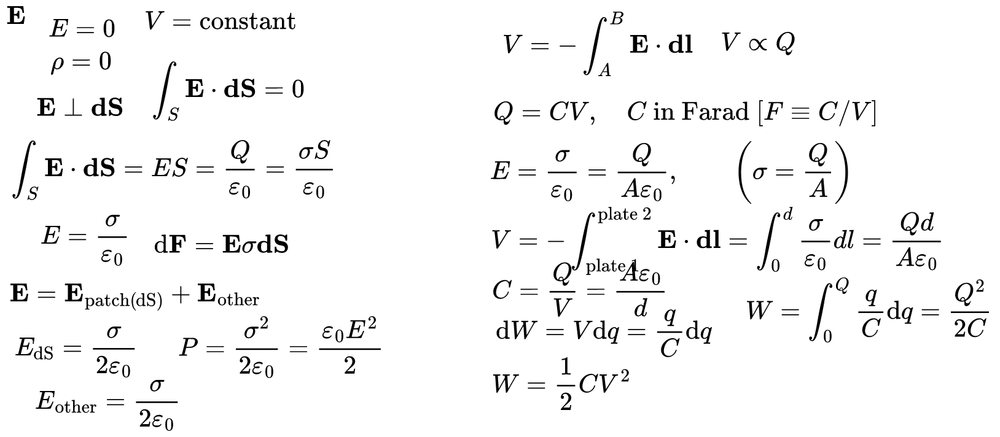](https://math.preview.excalidraw.com/#json=4abb9wCNobc6pcQI4NqRp,f2lYLO7pU6Rnv3BNENNglA)

- [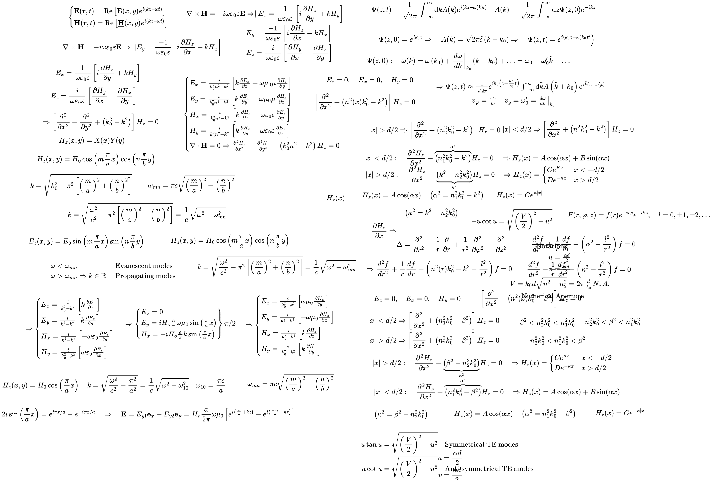](https://math.preview.excalidraw.com/#json=pVDDLYrUSxnd51n1HyuWL,dmnnGqpdl0I4hVL9Tut8iw)

- [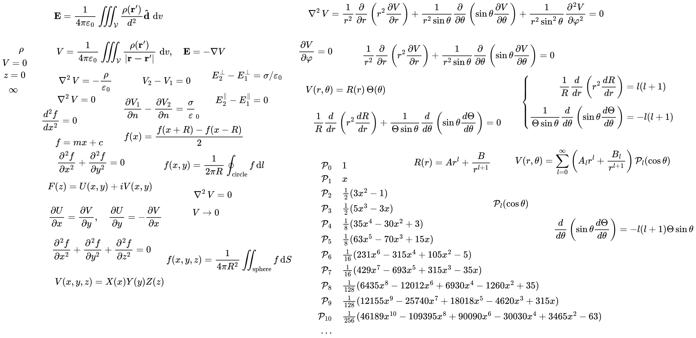](https://math.preview.excalidraw.com/#json=-_xRIacAW5hYH63IxbkcR,FuWoKqtUGnBn-YrnSAdIeA)

- [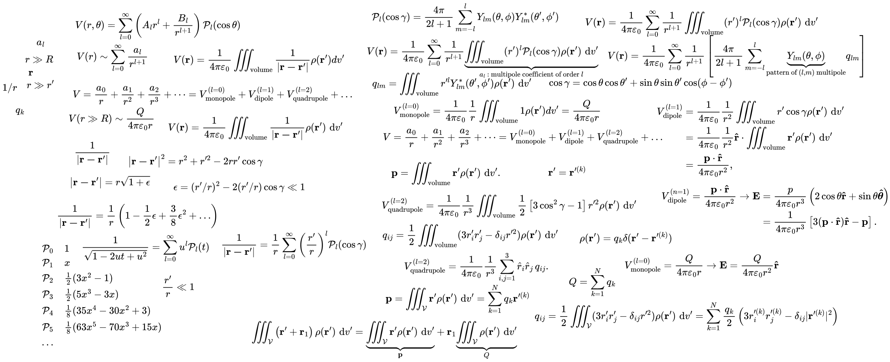](https://math.preview.excalidraw.com/#json=Mm19tyIPK4Xfz8wF5YDd6,TsZC7DT-Irff1qPv6g2l9Q)

- [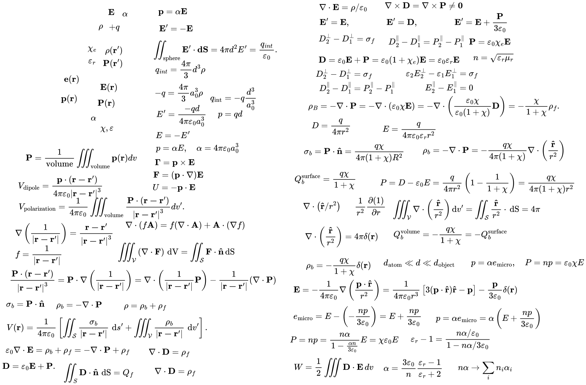](https://math.preview.excalidraw.com/#json=zugBAgXKdcurzHXPFLQq8,h9Hvx7XKIduhYjnEi1DfNg)

- [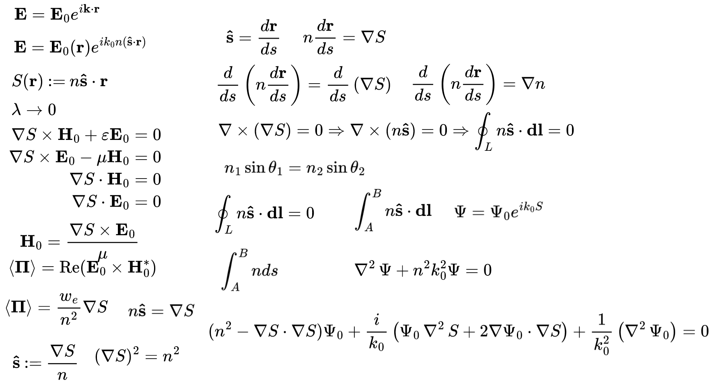](https://math.preview.excalidraw.com/#json=Ks9ODB36gulsnl5EsDh4z,DeJPVOtEDhOpzSacZwVi_w)
